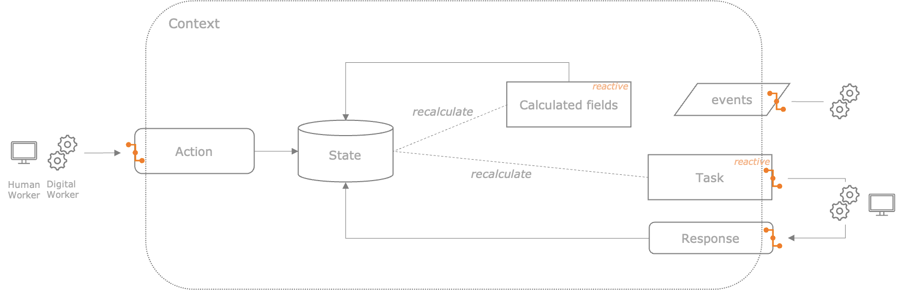

## Overview

Le't get an overview of **nimflow**.

### What is nimflow?

nimflow is a reactive task orchestrator for hyper-automation solutions. It let you build complex solutions to execute and monitor business processes requiring human and digital workers to collaborate. 

The reactive orchestration model:

