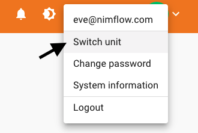
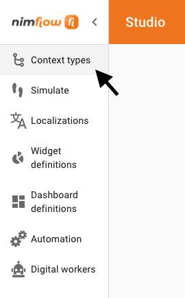
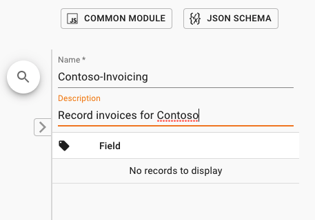
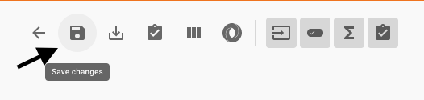

The Context Type is where the business logic is defined to orchestrate related activities.  We will create a new Context Type to start building our solution.  

1. Please sign in to [nimflow studio](https://ins.studio.nimflow.com/) and select a sandbox Business Unit. 

    

1. Select Context Types from the navigation menu in the left side of the page.

    

1. The main page will display the list of Context Types in this Business Unit. Select the + icon to create a new one. 

    

1. Fill the name and description with the data in the following image:

    

1. Save the changes to the Context Type.

    

Congratulations, you have created a new Context Type !!!!

