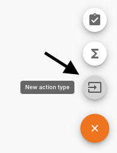
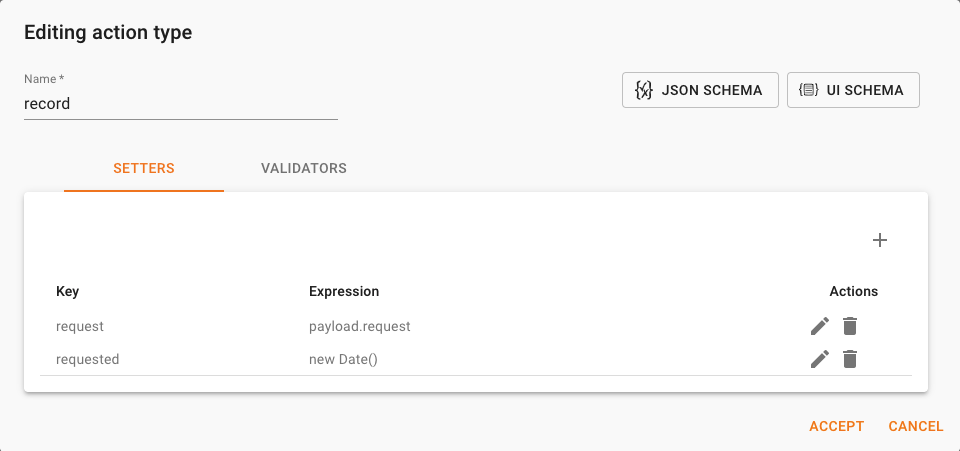
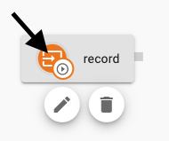

Actions represents messages sent to a Context. Contexts are instances created to keep the orchestration for different cases. To identify a Context, we must use the reference property. For our example, we will create Contexts for each different invoice, and we will set the reference with the account name and the invoice number.

When an action is classified as initial, the engine creates new Contexts for each different reference. If a Context with that reference exists, the engine send the message to that existing Context. 

Let’s create an Action Type to send requests for invoice recording in our orchestration. The data sent with the action (payload) will include the required data to create an invoice. 

1. Select the icon to create a new Action Type

    

1. Set the name to "record"

1. To define the payload for the Action Type, open the [JSON Schema](https://json-schema.org/) editor by selecting the **JSON Schema** button. Then complete the editor with the following data (you can copy and paste the schema):

    ```json
    {
        "type": "object",
        "properties:": {
            "request": {
                "type": "object",
                "properties": {
                    "date": {
                        "type": "string",
                        "format": "date"
                    },
                    "accountName": {
                        "type": "string"
                    },
                    "contactEmail": {
                        "type": "string",
                        "format": "email"
                    },
                    "amount": {
                        "type": "number"
                    }
                },
                "required":[
                    "date",
                    "accountName",
                    "amount"
                ]
            }
        },
        "required": [
            "invoice"
        ]
    }
    ```

    Then accept to return to the Action Type editor. 

1. You will now define fields to store the payload in the state of the context and also to track the moment when this request happen. Please complete the Setters as shown in the following image: 

    

    As you can see, the setter allows you to execute transformations with Javascript. Please try to avoid complex logic in the setters because you will need to send the message again to apply any modification. It is a recommended practice to receive the payload as pure as possible and to run transformation of data with Calculated Fields instead.

    We have embedded [Monaco](https://microsoft.github.io/monaco-editor/index.html) to edit Javascript expression, JSON Schemas, Dashboard Widgets, etc. The editor enables inline documentation and intellisense. 

1. Accept the changes to the Action Type. 

1. Let's indicate that this Action Type can initialize Context by selecting the Action Type icon as shown in the following image: 

    

1. Save the Context Type.

A Context Type must define at least one Action Type as ***Initial***, so new Contexts can be created.
