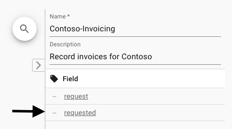
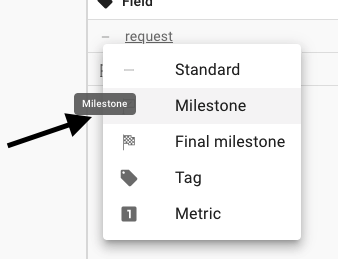
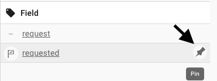
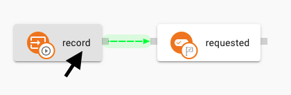
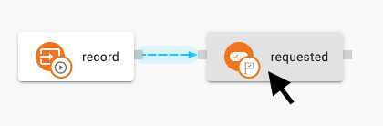

You will now set the field *requested* as a ***Milestone***. When a field is set as a milestone, nimflow saves together with the field value the date of the last update. This feature enables to explore changes along the time like in process mining.  

1. Open the field editor at the right side of the Context Type editor and select the dash at the left of field *requested*

    

1. Select the Milestone option from the dropdown.

    

3. Ping the field *requested* to the graph, so we can explore the dependencies with other elements.

    

When you can position the mouse over the *record* action type, the relationship with *requested* is in green (a depender). When you position the mouse over the *requested* field, the relationship with *record* action type is in blue (a dependee). This feature will help you to analize the orchestration dependencies. 

 