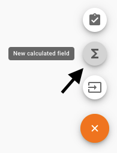
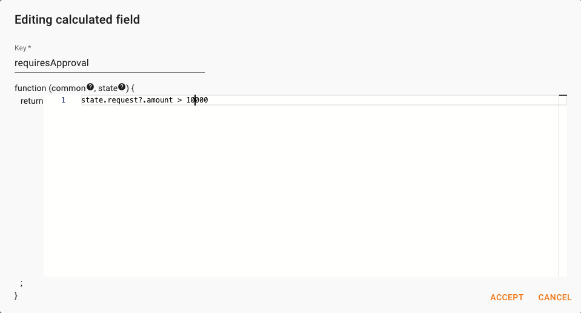

You will now create a Calculated Field to include a business rule into the orchestration. Calculated Fields are like formulas in Microsoft Excel. Whenever the state (Fields) are updated, the Calculated Fields are re-evaluated. The Calculated Fields expression can be written in [javascript](https://developer.mozilla.org/en-US/docs/Web/javascript). This feature also enables to call functions from different sources like Azure Functions, Cloudflare Workers or Amazon Lambda.  

Let's create the *requiresApproval* field:

1. Select the icon to create a new Calculated Field

    

1. Set the name to "requiresApproval"

1. Write or copy the following expression:

    ```javascript
    state.request?.amount > 10000
    ```
    The result should be as the following image:

    

1. Accept the changes

A Calculated Field is like any other field of the state. You will now use this Calculated Field for the condition of the *Approve Invoice Recording* task. 

Please remember to save the Context Type. 