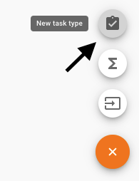
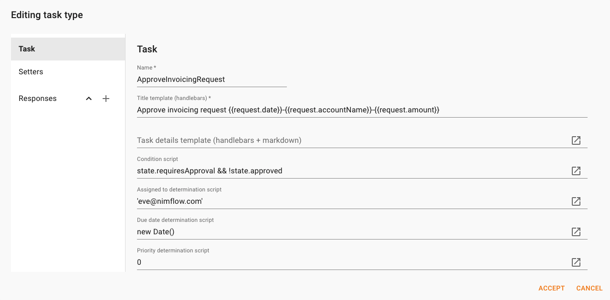
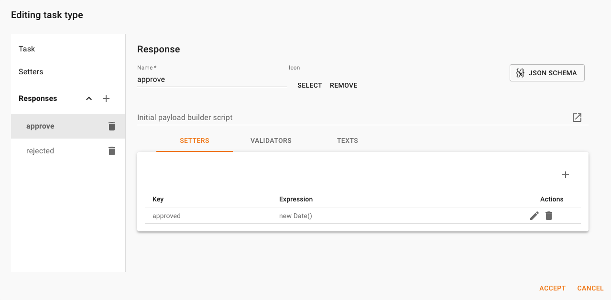
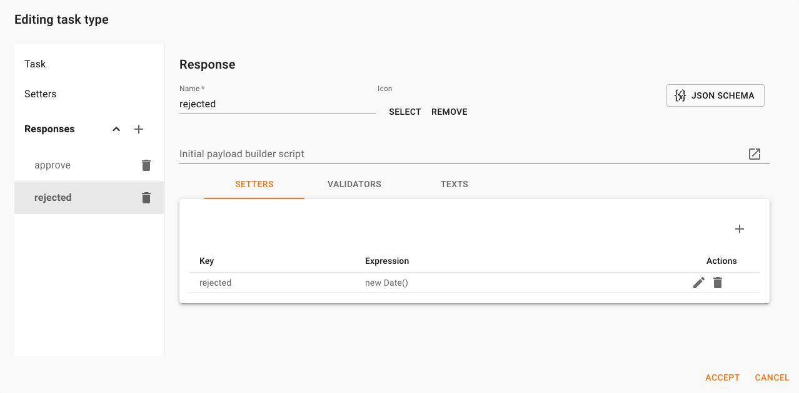

We will now create a Task Type to approve the invoicing request when the total amount exceeds 10,000 ( the calculated field *requiresApproval* is true). 

## Add a Task Type

1. Select the icon to create a Task Type

    

1. Fill the following data:

    Field     | Value | Description 
    ----------|-------|------------
    |Name|```ApproveInvoicingRequest```| The name of the task
    |Title| ```Approve invoicing request {{request.date}}-{{request.accountName}}-{{request.amount}} ```| A [handlebars](https://handlebarsjs.com/) expression for the title of the task
    |Details| | Optional. A [handlebars](https://handlebarsjs.com/) expression for the details of the task.
    | Condition | ```state.requiresApproval && !state.approved``` | A [javascript](https://developer.mozilla.org/en-US/docs/Web/javascript) expression to activate the task. Whenever this condition returns [truthy](https://developer.mozilla.org/en-US/docs/Glossary/Truthy) the task is activated.
    | Assigned to | ```[your user email]```| Optional. A [javascript](https://developer.mozilla.org/en-US/docs/Web/javascript) expression to assign the task to a worker. This could be used to dynamically change the assignment of a task.
    | Due Date | ```new Date()```| Optional. A [javascript](https://developer.mozilla.org/en-US/docs/Web/javascript) expression to set the Due Date of the task.
    | Priority | ``` 0 ```| Optional. A [javascript](https://developer.mozilla.org/en-US/docs/Web/javascript) expression to set the Priority of the task.

    The result should be like in the following image:

    

## Add a Task Response

You will now add the possible responses for the created task. 

1. Select the ```+```  icon to add a response and fill the data as in the following image: 

    

1. Now add another response as in the following image:

    

1. Accept the Task Type and set the following fields:

    Field            | Classification
    -------------    | --------------
    approved         | Milestone
    rejected         | Final milestone
    requiresApproval | tag
    
    A Final Milestone archives the context and no other reaction is processes. This is the reason we didn't include ```!state.rejected``` in the task type condition. If *rejected* is not set as Final Milestone, we will need to include this expression to do not activate the task after this event.    

1. Save the Context Type

Yo have completed the first Context Type. So let's simulate some Contexts.