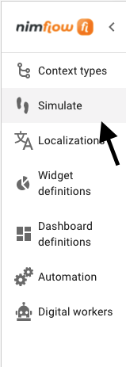
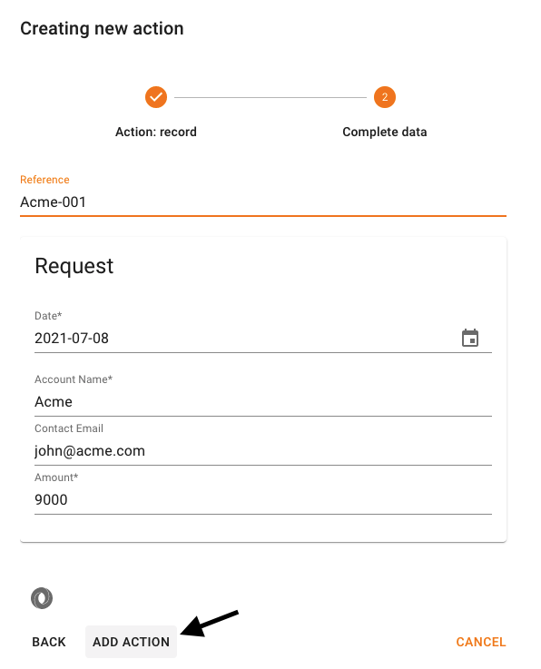
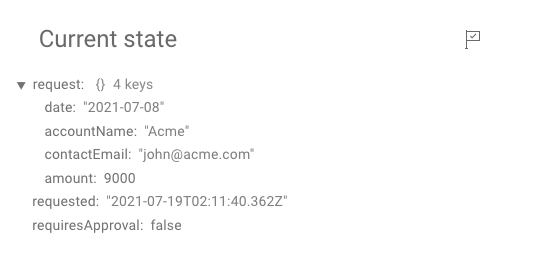
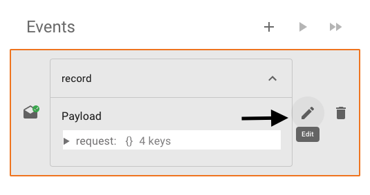
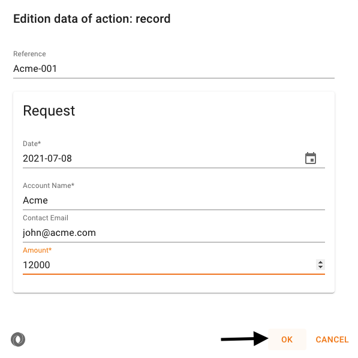
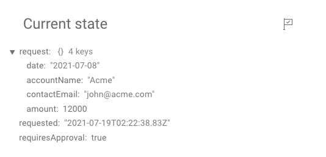
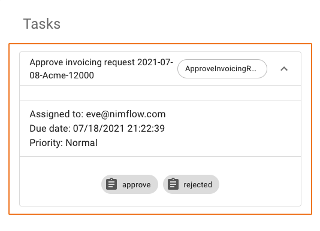
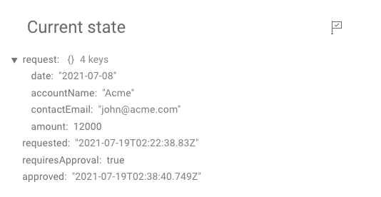
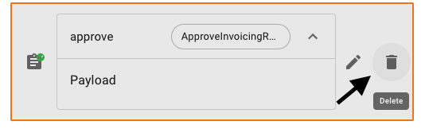
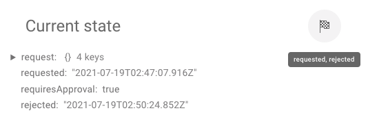

nimflow includes a Context simulator to explore and validate Context Types. This is a usefull tool during the Context Type creation because it enables to validate the reactions to different events. 

## Simulate the Initial Action

 1. Select Simulate from the navigation menu in the left side of the page.

    

1. Select the ```+``` icon to create a new simulation

1. Select ```Contoso-invoicing``` from the Context Type list. 

1. In the simulation editor complete the name with ```Contoso-invoicing-dev-001```. 

1. Select the ```+``` icon in the Event box to simulate an Action.

1. Choose ```Record```, complete the form with the data in the following image and then select ```ADD ACTION```:

    

1. You can now explore the state after simulating the action in the ```Current state``` box.

    

    You can see the milestone *requested* indicated with a flag in the top-right corner and the calculated field ```requiresApproval: false``` because ```request.amount```is lower than 10000. This is the reason because the task *ApproveInvoicingRequest* has not been activated. 
    
Let's now change the payload of this simulated event to test the task creation.

## Change the Initial Action payload
1. Instead of creating a new Action, we will just update the payload of the created action. For this, expand the record event and select the icon to open the payload as in the following image: 

    

1. Change the amount to ```12000```and the select ```ok```to confirm the change. 

    

1. Now ```Current state``` box shows ```requiresApproval: true``` and the task ```ApproveInvoicingRequest``` is activated.

    
    

## Simulate Responses

Let's simulate different responses:

1. In the *Tasks* box for the task *ApproveInvoicingRequest* select ```approved```.

1. Select send in the response dialog box.

1. Select to expand the *approve* event to cause the recalculation of the state. This is only required in the simulation allow the step-by-step exploration.

1. Now the state has the milestone *approved* and the task has been deactivated, according to the defined condition for the task. 

    

You will now simulate the *reject* response:

1. Delete the last event selecting the icon shown in the following image:

    

1. Select ```DELETE ALL``` and then expand the the *record* event to recalculate the state.

1. In the *Tasks* box for the task *ApproveInvoicingRequest* select ```rejected```.

1. Select send in the response dialog box.

1. Now the state has the final milestone *rejected* and the task has been deactivated. Once a final milestone is reached, all active tasks are deactivated. This is the reason why it is not neccesary to include this milestone in the task condition.  

    

Congratulations, we have created a new Context Type and simulated the orchestation ! You are now ready to **run** the orchestation.

